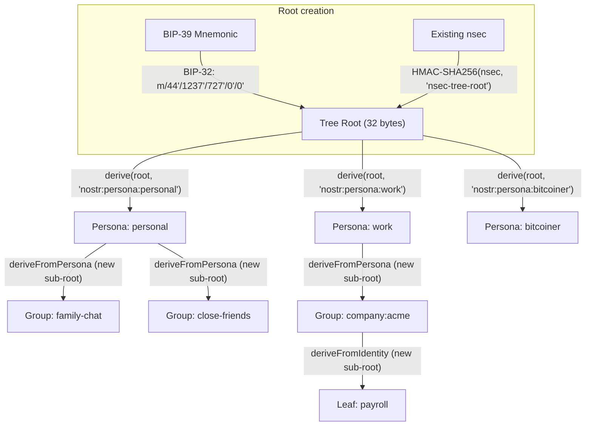
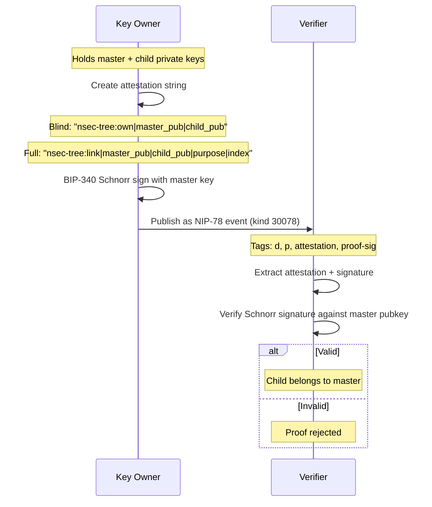

# nsec-tree Architecture

> **This component is part of the [ForgeSworn Identity Stack](https://github.com/forgesworn/heartwood/blob/main/docs/ECOSYSTEM.md).** See the ecosystem overview for how it connects to the other components.

nsec-tree is a deterministic Nostr key derivation library. One master secret generates unlimited child identities using HMAC-SHA256. Unlinkable by default, with optional BIP-340 Schnorr linkage proofs for selective disclosure. No relay changes, no client changes -- derived keys are standard Nostr keypairs.

## Derivation hierarchy

Two independent paths create the tree root. From there, HMAC-SHA256 derivation produces arbitrarily deep hierarchies.



Personas derive directly from the master root. Groups and deeper nodes derive from a **new sub-root** created from the parent's private key via `fromNsec()`. This re-keying step is the core isolation property: compromising a persona key lets an attacker derive its groups, but the groups cannot be derived from the master root with a longer purpose string.

Each derivation step computes `HMAC-SHA256(parent_secret, context)` where context is:

```
"nsec-tree\0" || purpose_bytes || "\0" || index_u32_be
```

If the result exceeds the secp256k1 curve order (probability ~3.7 x 10^-39), the index auto-increments and retries. The caller receives the actual index used.

## Linkage proofs

Prove two pubkeys share a master without revealing the master or derivation path.



**Blind proofs** hide the derivation path (purpose and index). Use for: persona rotation, proving ownership without revealing structure.

**Full proofs** reveal the derivation path. Use for: accountability, audit trails, transparent identity hierarchies.

## Module structure

Tree-shakeable entry points for minimal bundle size:

| Import path | Contents | BIP-32 dependency? |
|-------------|----------|--------------------|
| `nsec-tree` | Full API | Yes |
| `nsec-tree/core` | fromNsec, derive, recover, zeroise | No |
| `nsec-tree/mnemonic` | fromMnemonic only | Yes |
| `nsec-tree/proof` | createBlindProof, createFullProof, verifyProof | No |
| `nsec-tree/persona` | derivePersona, deriveFromPersona, recoverPersonas | No |
| `nsec-tree/event` | toUnsignedEvent, fromEvent | No |
| `nsec-tree/encoding` | NIP-19 bech32 helpers | No |

## Security model

**Why HMAC-SHA256 instead of BIP-32?** In BIP-32, an extended public key plus any single child private key reveals the parent private key. In Nostr, child keys sign public events (observable). HMAC-SHA256 is strictly one-way: compromising a child reveals nothing about the root or siblings.

**Unlinkable by default.** Two child npubs are cryptographically indistinguishable from independent keys. No observer can prove they share a master without a linkage proof. Metadata correlation (timing, IP, content) remains an operational security concern.

**Compromise blast radius:**

| Compromised | Affected | Unaffected | Recovery |
|-------------|----------|------------|----------|
| Group key | That group only | Persona, master, siblings | Rotate to new index |
| Persona key | Persona + all its groups | Master, other personas | New persona index + blind proof |
| Master secret | Everything | Nothing | New mnemonic, migrate all |

**Zeroisation.** Tree roots use WeakMap + FinalizationRegistry for automatic secret cleanup. `destroy()` zeroes the secret immediately. `zeroise(identity)` overwrites the private key bytes. The bech32 nsec string is an immutable JS string and cannot be overwritten -- store `privateKey` bytes, not `nsec`, for signing.

## Cryptographic primitives

All from audited libraries by Paul Miller (no custom cryptography):

- **HMAC-SHA256:** @noble/hashes
- **BIP-32 / BIP-39:** @scure/bip32, @scure/bip39
- **BIP-340 Schnorr:** @noble/curves/secp256k1
- **Bech32:** @scure/base

## Integration points

- **[Heartwood](https://github.com/forgesworn/heartwood):** heartwood-core re-implements nsec-tree's derivation in Rust. Frozen test vectors ensure byte-level compatibility between the TypeScript and Rust implementations.
- **[Bark](https://github.com/forgesworn/bark):** Bark's persona UI maps to nsec-tree's derivation model. Persona switching, derivation, and identity listing are Heartwood RPC calls that use nsec-tree under the hood.
- **[Sapwood](https://github.com/forgesworn/sapwood):** Uses the TypeScript nsec-tree library for provisioning (computing derived roots in-browser before sending to the device).
- **[canary-kit](https://github.com/forgesworn/canary-kit):** Uses nsec-tree group keys for duress-resistant verification ceremonies.
- **[ForgeSworn Identity Stack](https://github.com/forgesworn/heartwood/blob/main/docs/ECOSYSTEM.md):** nsec-tree is the cryptographic foundation of the signing stack.
